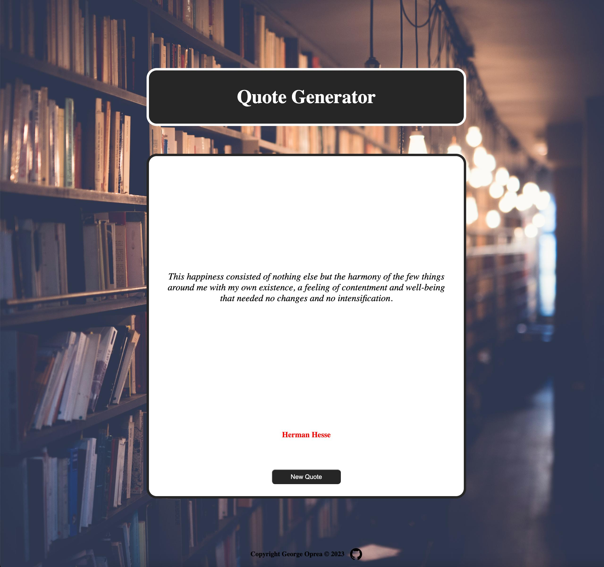

# [Quote Generator](https://georgeoprea1.github.io/quotes-generator/)

#### This exercise is part of the free code camp curriculum and has the purpose of learning how to make api calls.

## Features

- Generate a random quote by pressing the button

## Technologies

- JavaScript
- CSS
- HTML
